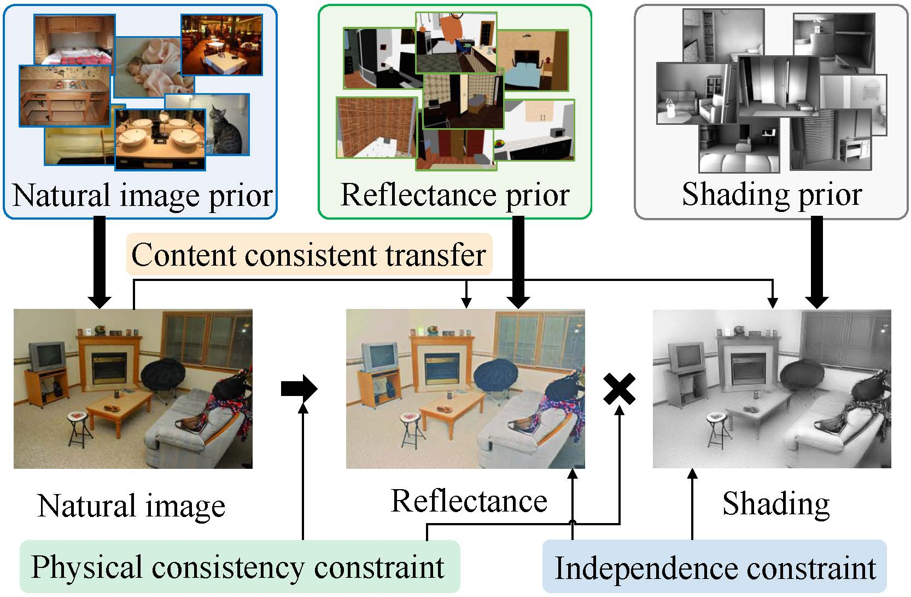
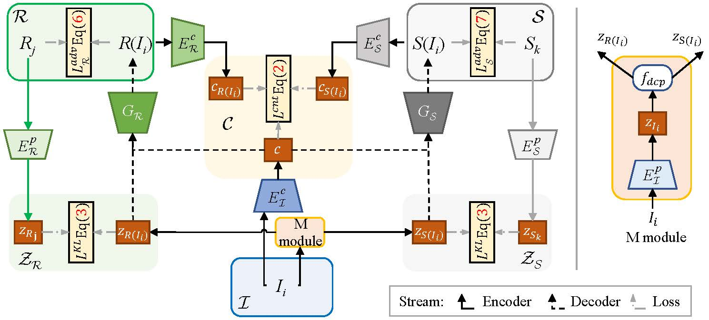
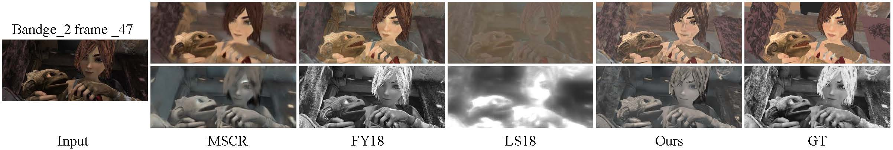

# Unsupervised Learning for Intrinsic Image Decomposition from a Single Image


 Our paper is accepted by **CVPR2020**. 

<div align=center>   </div>

**Picture:**  *Our method learns intrinsic image decomposition in an unsupervised fashion where the ground truth reflectance and shading is not available in the training data.*


<div align=center>   </div>

**Picture:**  *The proposed architecture.*


<div align=center>   </div>

**Picture:**  *Visual results on MPI Sintel benchmark.*


This repository contains the official PyTorch implementation of the following paper:

> **Unsupervised Learning for Intrinsic Image Decomposition from a Single Image**<br>
>  Yunfei Liu, Yu Li, Shaodi You, Feng Lu<br> https://arxiv.org/abs/1911.09930 
> 
>**Abstract:**   Intrinsic image decomposition, which is an essential task in computer vision, aims to infer the reflectance and shading of the scene. It is challenging since it needs to separate one image into two components. To tackle this, conventional methods introduce various priors to constrain the solution, yet with limited performance. Meanwhile, the problem is typically solved by supervised learning methods, which is actually not an ideal solution since obtaining ground truth reflectance and shading for massive general natural scenes is challenging and even impossible. In this paper, we propose a novel unsupervised intrinsic image decomposition framework, which relies on neither labeled training data nor hand-crafted priors. Instead, it directly learns the latent feature of reflectance and shading from unsupervised and uncorrelated data. To enable this, we explore the independence between reflectance and shading, the domain invariant content constraint and the physical constraint. Extensive experiments on both synthetic and real image datasets demonstrate consistently superior performance of the proposed method. 

## Resources

Material related to our paper is available via the following links:

- Paper:  https://arxiv.org/abs/1911.09930 
- Project: https://liuyunfei.net/publication/cvpr2020_usi3d/external_pages/index.html
- Code: https://github.com/DreamtaleCore/USI3D

## System requirements

* Only Linux is tested, Windows is under test.
* 64-bit Python 3.6 installation. 
* PyTorch 1.2.0 or newer with GPU support.
* One or more high-end NVIDIA GPUs with at least 8GB of DRAM.
* NVIDIA driver 391.35 or newer, CUDA toolkit 9.0 or newer, cuDNN 7.3.1 or newer.

## Playing with pre-trained networks and training

### Test

1. Download the pretrained model, and put them to the `pretrained_model` dir
2. Run the command below to decompose images into albedo and shading

```bash
python3 test.py -c configs/intrinsic_MPI.yaml -i /your/test/images/root/ -o ./results/ -p /pretrained_model/MPI.pt
```

Then then results will be generated in the `./results` dir.

### Train
1. Download the dataset to your `<your_dataset_root>`.
2. Midify the `data_root` to `<your_dataset_root>` in the `*.yaml` in the `./configs`.
3. Run the commands below to train the model.

```bash
python3 train.py -c configs/intrinsic_MPI.yaml -o ./checkpoints/ -g <your gpu id>
```

## Citation

If you find this work or code is helpful in your research, please cite:

```latex
@inproceedings{Liu2020Unsupervised,
	title={Unsupervised Learning for Intrinsic Image Decomposition from a Single Image},
	author={Liu, Yunfei and Li, Yu and You, Shaodi and Lu, Feng},
	booktitle={CVPR},
	year={2020}
}
```

## Contact

If you have any questions, feel free to E-mail me via: `lyunfei(at)buaa.edu.cn`
